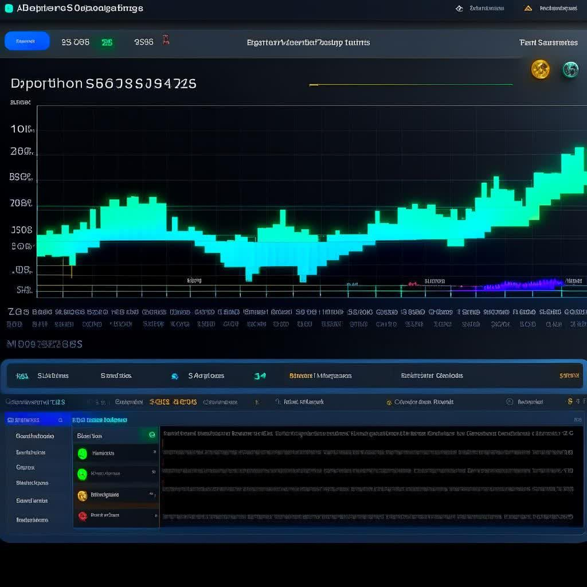

# System Performance Monitor
<div align="center">

</div>

Welcome to System Performance Monitor, a robust Python application that serves as your personal system health dashboard. This application is designed to provide real-time monitoring and detailed analysis of various critical aspects of your system's performance.

Whether you're interested in tracking CPU usage, RAM consumption, network traffic, GPU temperature, or battery charge, System Performance Monitor has got you covered. It leverages the power of Python libraries to fetch and process system data, presenting it in an easily digestible format.

What sets this application apart is its use of a Pygame GUI for data visualization, coupled with terminal-based plots for a more granular view of system performance. This dual-mode display ensures you have all the information you need at your fingertips, whether you prefer a graphical interface or a command-line view.

Designed with simplicity and efficiency in mind, System Performance Monitor is your go-to tool for keeping an eye on your system's health and performance. Whether you're a power user wanting to optimize your system, a developer debugging performance issues, or just curious about your system's workings, this application is for you.

Join us as we dive into the world of system monitoring and performance optimization. Welcome aboard!
## Dependencies
The application makes use of the following Python libraries:

`os
time
plotille
psutil
GPUtil
cpuinfo
numpy`

## Installation
To install the necessary libraries, run the following command:

```bash
pip install plotille psutil gputil cpuinfo numpy
```
## Usage
To start monitoring your system, navigate to the directory containing the application and run the following command:
```bash
python src/main.py
```

This will initiate the monitoring process and the results will be displayed in the terminal.

## Features
The application provides the following features:

* System CPU usage monitoring
* RAM usage monitoring
* Network traffic monitoring
* GPU temperature and usage monitoring
* Battery charge monitoring 

Each feature corresponds to a specific function in the application that performs the monitoring task and returns the relevant data.
## Contributing
Contributions to the project are welcome. If you have a feature request, bug report, or want to improve existing features, please feel free to make a pull request or open an issue.

## License
This project is licensed under the MIT [License](LICENSE).

## shots

